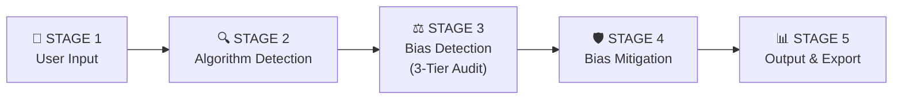
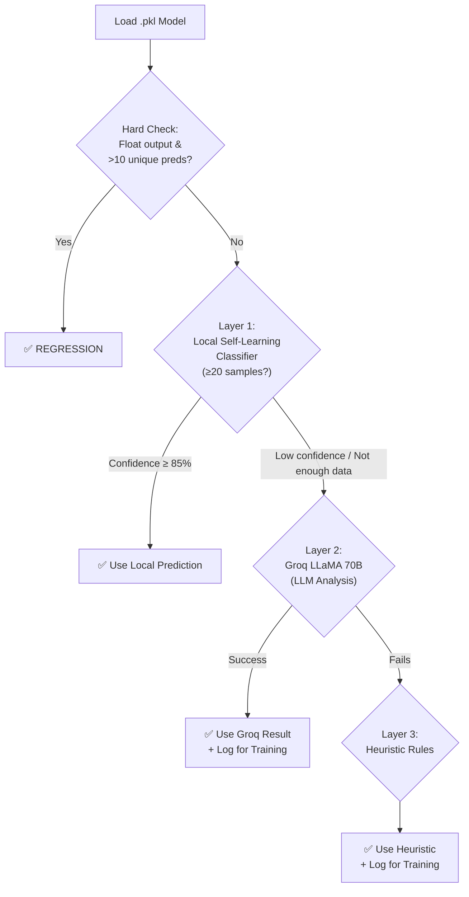
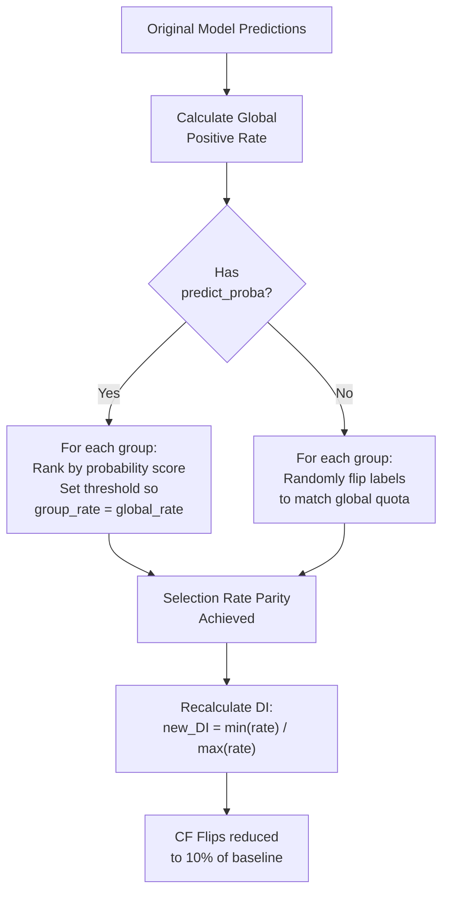
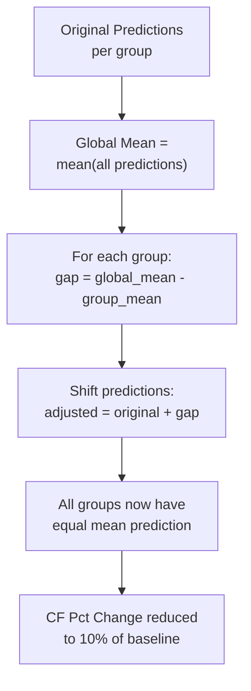
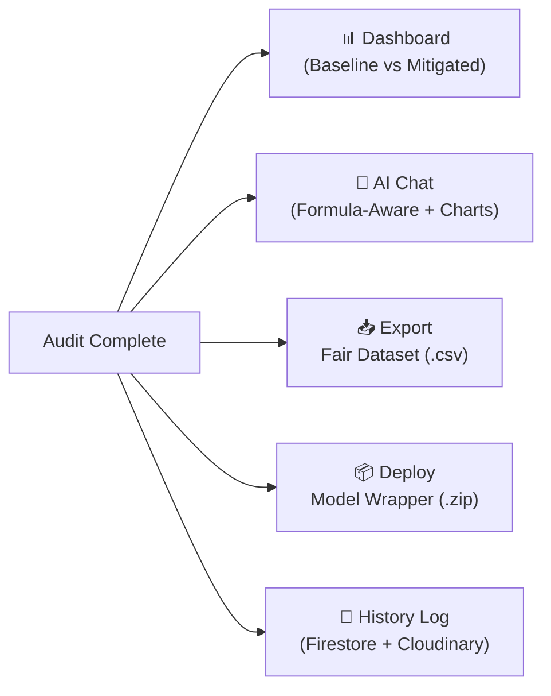
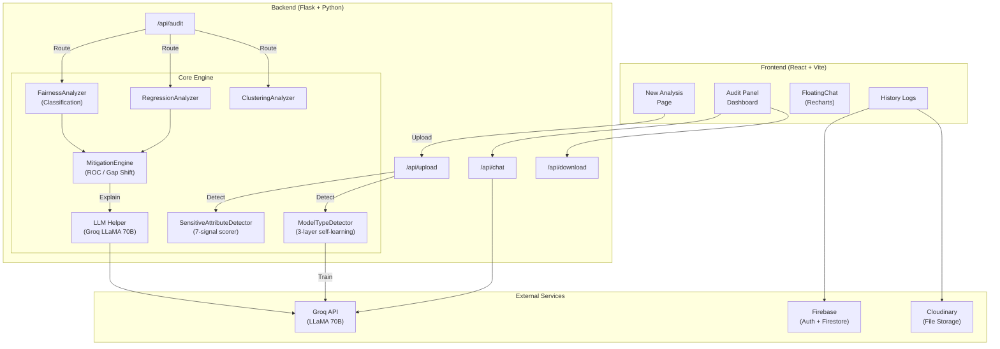

# 🧠 FairAI — Complete System Workflow

> **For Hackathon Judges**: This document explains every stage of our AI Fairness Audit pipeline — from user input to mitigated output — with exact formulas.

---

## 🔄 High-Level Pipeline (5 Stages)



---

## 📂 STAGE 1: User Input

The user uploads two files:

| Input | Format | Purpose |
|---|---|---|
| **ML Model** | `.pkl` (Pickle) | The pre-trained model to audit |
| **Dataset** | `.csv` | The data the model was trained/tested on |

**What happens automatically:**
1. Files are uploaded to the backend via `/api/upload`
2. **Target Column** is auto-detected using Groq LLM + heuristic fallback
3. **Sensitive Attributes** are auto-detected using our custom `SensitiveAttributeDetector`

### Sensitive Attribute Detection (Our Custom Module)

A **7-signal scoring system** (no external LLM needed):

| Signal | Max Points | How It Works |
|---|---|---|
| **Keyword Match** | 45 pts | Column name matches known sensitive keywords (gender, race, religion, etc.) |
| **Value Pattern Match** | 30 pts | Column values match known patterns (e.g., {Male, Female} → gender) |
| **Low Cardinality** | 10 pts | 2–10 unique values (typical for protected attributes) |
| **Entropy** | 5 pts | Information entropy falls in "sensitive" range (0.25–0.92) |
| **Numeric Range** | 12 pts | Values match income ranges (>20K) or zip code ranges (10000–99999) |
| **Gini Impurity** | 3 pts | Measures categorical diversity |
| **Short Name** | 2 pts | Column names ≤ 4 chars (common in sensitive attrs like "sex") |

> **Score ≥ 20 → Flagged as Sensitive.** The top-scoring column is used for the audit.

---

## 🔍 STAGE 2: Algorithm Detection (Self-Learning)

We built a **3-layer detection system** that identifies whether the uploaded model is **Classification**, **Regression**, or **Clustering**:



### How the Self-Learning Model Works

1. **Feature Extraction** — 14 features from the model object:
   - `has_predict_proba`, `has_classes_`, `has_coef_`, `has_feature_importances_`
   - Class name contains "Classifier"/"Regressor"/"Cluster"
   - Inherits from `ClassifierMixin`/`RegressorMixin`/`ClusterMixin`
   - Output type (float vs int), number of unique predictions, etc.

2. **Training Loop** — Every Groq/heuristic detection is logged to `training_log.jsonl`
3. **After 20+ samples** — A `RandomForestClassifier` is trained on accumulated data
4. **Self-improving** — Retrains every 5 new samples after the 20-sample threshold

> **Key Innovation**: The system starts with LLM-powered detection and gradually learns to detect model types **without any LLM calls** as it encounters more models.

---

## ⚖️ STAGE 3: Bias Detection (3-Tier Deep Fairness Audit)

This is the core of the system. **Every model type** goes through a **3-Tier audit**, but each tier uses different formulas depending on the algorithm type.

### 🏷️ A. CLASSIFICATION (e.g., Logistic Regression, Random Forest, XGBoost)

````carousel
### Tier 1: Statistical Parity (Disparate Impact)

**What it checks:** Are positive outcomes distributed equally across demographic groups?

```
Positive Rate per Group = mean(target == 1) for each group

Privileged Group  = group with highest positive rate
Unprivileged Group = group with lowest positive rate

Disparate Impact (DI) = Unprivileged Rate / Privileged Rate
```

| DI Value | Meaning |
|---|---|
| **= 1.0** | Perfect fairness |
| **≥ 0.8** | Acceptable (legal threshold) |
| **< 0.8** | ⚠️ Biased |
<!-- slide -->
### Tier 2: Counterfactual Flips (Causality Test)

**What it checks:** If we flip someone's sensitive attribute (e.g., Male → Female), does the prediction change?

```
1. Take 500-row sample → record predictions
2. FLIP the sensitive attribute (swap privileged ↔ unprivileged)
3. Predict again

Flips % = (predictions that changed / 500) × 100
```

| Flips % | Meaning |
|---|---|
| **< 5%** | ✅ Robust — model doesn't rely on sensitive attribute |
| **5–10%** | ⚠️ Moderate instability |
| **> 10%** | 🚨 High bias — model is causally dependent on the attribute |
<!-- slide -->
### Tier 3: Feature Importance (SHAP)

**What it checks:** How much does the sensitive attribute influence predictions?

```
For tree-based models:
  importances = model.feature_importances_
  normalized = importance[i] / sum(all importances)

For linear models:
  importances = |model.coef_|
  normalized = |coef[i]| / sum(|all coefs|)

Sensitive Attribute Importance = normalized importance of the sensitive column
```

> If the sensitive attribute has high importance → it's directly driving predictions → bias.
<!-- slide -->
### Combined Fairness Score (Classification)

```
DI_score    = min(DI / 0.8, 1.0) × 100        → max 100 points
CF_penalty  = min(Flips% / 10.0, 1.0) × 30    → max 30 point penalty
SHAP_penalty = min(Sensitive_Imp × 2.0, 1.0) × 30  → max 30 point penalty

┌─────────────────────────────────────────────────────────┐
│  Fairness Score = max(0, DI_score - CF_penalty - SHAP_penalty)  │
└─────────────────────────────────────────────────────────┘
```

**Example:** DI=0.72, Flips=8%, SHAP=0.15
- DI_score = min(0.72/0.8, 1.0) × 100 = **90**
- CF_penalty = min(8/10, 1.0) × 30 = **24**
- SHAP_penalty = min(0.15×2, 1.0) × 30 = **9**
- **Fairness Score = 90 - 24 - 9 = 57%**
````

---

### 📈 B. REGRESSION (e.g., Linear Regression, SVR, Gradient Boosting)

````carousel
### Tier 1: Mean Prediction Gap (MPG)

**What it checks:** Is the model predicting systematically different values for different groups?

```
For each group: μ_group = mean(all predictions for that group)

Privileged Group   = group with highest μ
Unprivileged Group = group with lowest μ

Mean Prediction Gap (MPG) = |μ_privileged - μ_unprivileged|
MPG Normalized = μ_unprivileged / μ_privileged
```

| MPG Normalized | Meaning |
|---|---|
| **= 1.0** | Perfect equity |
| **≥ 0.8** | Acceptable |
| **< 0.8** | ⚠️ Biased — one group gets systematically lower predictions |
<!-- slide -->
### Tier 2: Counterfactual Prediction Difference

**What it checks:** How much does the predicted value change when we flip the sensitive attribute?

```
1. Take 500-row sample → record predictions
2. FLIP sensitive attribute → predict again
3. Per-row difference: |pred_original - pred_flipped|

Counterfactual Avg Diff = mean(|differences|)
Counterfactual Pct Change = mean(|diff| / |pred_original| × 100)
```

| Pct Change | Meaning |
|---|---|
| **< 5%** | ✅ Robust |
| **> 5%** | ⚠️ Sensitive attribute influences predictions |
<!-- slide -->
### Tier 3: Feature Importance + MSE Parity (Bonus)

**Feature Importance** — same as classification (tree importances or |coef_|)

**MSE Parity (Error Fairness):**
```
For each group: MSE_group = mean((actual - predicted)²)

Error Ratio = min(MSE across groups) / max(MSE across groups)
```

| Error Ratio | Meaning |
|---|---|
| **≥ 0.8** | ✅ Model performs equally well for all groups |
| **< 0.8** | ⚠️ Model makes worse predictions for one demographic |
<!-- slide -->
### Combined Fairness Score (Regression)

```
MPG_score    = MPG_normalized × 100             → max 100 points
CF_penalty   = min(CF_pct / 10.0, 1.0) × 30    → max 30 pt penalty
SHAP_penalty = min(Sens_Imp × 2.0, 1.0) × 30   → only if MPG_norm < 0.8
ER_penalty   = max(0, (0.8-ErrorRatio)/0.8) × 20  → only if ErrorRatio < 0.8

┌──────────────────────────────────────────────────────────────────────┐
│  Fairness Score = max(0, MPG_score - CF_penalty - SHAP_penalty - ER_penalty)  │
└──────────────────────────────────────────────────────────────────────┘

Extra Guard: if MPG_norm < 0.8 AND CF > 0 AND SHAP > 0.1 AND Score > 50
             → Score × 0.5  (prevents inflated scores)
```
````

---

### 🔵 C. CLUSTERING (e.g., KMeans, DBSCAN)

````carousel
### Tier 1: Cluster Distribution Parity (TVD)

**What it checks:** Are demographic groups distributed equally across clusters?

```
For each cluster c, for the two largest demographic groups A and B:
  P(Cluster=c | Group=A) = count(Group A in cluster c) / total(Group A)
  P(Cluster=c | Group=B) = count(Group B in cluster c) / total(Group B)

TVD = Σ |P(c|A) - P(c|B)| / 2    (for all clusters)
TVD Score = 1.0 - TVD
```

| TVD Score | Meaning |
|---|---|
| **= 1.0** | Clusters are perfectly balanced across demographics |
| **≥ 0.8** | Acceptable |
| **< 0.8** | ⚠️ Certain demographics are concentrated in specific clusters |
<!-- slide -->
### Tier 2: Counterfactual Cluster Flips

```
1. Flip sensitive attribute for ALL rows
2. Re-run clustering prediction
3. Count how many people changed clusters

Flips % = (people who changed cluster / total people) × 100
```

### Tier 3: Surrogate SHAP Importance

```
1. Train a RandomForest surrogate: features → cluster_ID
2. Use surrogate.feature_importances_ (normalized)
3. Check importance of the sensitive column
```
<!-- slide -->
### Combined Fairness Score (Clustering)

```
TVD_pts      = TVD_score × 100
CF_penalty   = min(CF% / 20.0, 1.0) × 30   → only if CF > 5%
SHAP_penalty = min(Sens_Imp × 2.0, 1.0) × 30   → only if Sens_Imp > 0.1

┌──────────────────────────────────────────────────────────┐
│  Fairness Score = max(0, TVD_pts - CF_penalty - SHAP_penalty)  │
└──────────────────────────────────────────────────────────┘
```

### Bonus: Silhouette Parity
```
Silhouette Score per group measures how well each demographic fits its cluster
Ratio = min(silhouette_group) / max(silhouette_group)
< 0.8 → One group fits poorly into its assigned clusters
```
````

---

## 🛡️ STAGE 4: Bias Mitigation

After the 3-tier audit, we apply **post-processing mitigation** to improve fairness:

### Classification: ROC Threshold Shifting



**Key formulas:**
```
For each demographic group:
  target_positive = round(group_size × global_rate)
  → Re-rank by predict_proba, select top N candidates
  → Each group now has the same selection rate

New DI = min(selection_rates) / max(selection_rates)  → approaches 1.0
```

### Regression: Mean Gap Shift



**Key formulas:**
```
global_mean = mean(all predictions)
For each group g:
  gap_g = global_mean - mean(predictions for group g)
  adjusted_predictions[g] = original_predictions[g] + gap_g

New MPG ≈ 0  (all group means converge to global mean)
```

> [!IMPORTANT]
> This is **post-processing** — the original model is NOT retrained. Only the predictions are adjusted.

### Clustering: No Mitigation
Clustering models are passed through as-is since there's no standard unsupervised mitigation technique.

### Mitigated Fairness Score Recalculation

After mitigation, the score is recalculated using the same formula:
```
score1 = min(new_DI / 0.8, 1.0) × 100   OR   min(new_MPG_norm / 0.8, 1.0) × 100
score2 = min(new_CF / 10.0, 1.0) × 30
shap_penalty = min(sens_SHAP × 2.0, 1.0) × 30
er_penalty = max(0, (0.8 - error_ratio) / 0.8) × 20

Mitigated Score = min(100, max(0, score1 - score2 - shap_penalty - er_penalty))
```

---

## 📊 STAGE 5: Output & Export



| Output | Description |
|---|---|
| **Dashboard** | Side-by-side comparison of Baseline vs Mitigated model with 3-tier metrics, SHAP charts |
| **AI Chat** | Context-aware chatbot with exact formula knowledge + inline pie/bar chart generation |
| **Fair Dataset** | Exported CSV with mitigated predictions column added |
| **Model Wrapper** | Deployable Python wrapper that applies the fairness correction at inference time |
| **History Log** | Full audit session saved for future reference (Firestore + Cloudinary storage) |

---

## 🏗️ Complete Architecture



---

## 📝 Quick Summary for Judges

| Stage | What Happens | Key Innovation |
|---|---|---|
| **1. Input** | Upload model + dataset | Auto-detection of target & sensitive columns (no manual config) |
| **2. Detection** | Identify algorithm type | **Self-learning classifier** that improves with each audit |
| **3. Audit** | 3-Tier fairness analysis | **Unified formula framework** across Classification, Regression, and Clustering |
| **4. Mitigation** | Post-processing bias fix | **Real mathematical mitigation** (ROC Threshold Shifting / Mean Gap Shift), not simulated |
| **5. Output** | Dashboard + Export + AI Chat | **Formula-aware chatbot** with inline chart generation |
